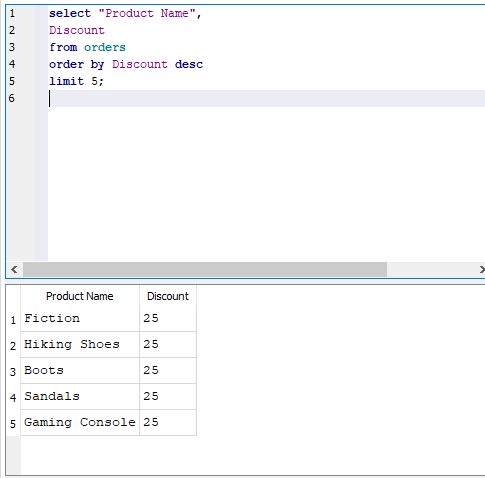
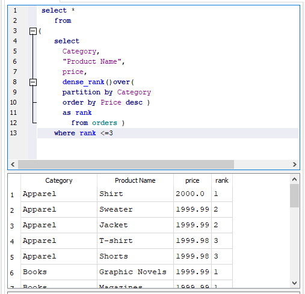

# 📊 SQL Projects Portfolio

##  Project : E-COMMERCE SALES ANALYSIS 
### *PRODUCT ANALYSIS*
#### **Top 5 Most Expensive Products**
```sql
SELECT "Product Name", price
FROM orders
ORDER BY price DESC 
LIMIT 5;
```


📌 Insight: Identifies expensive products. These items drive high per-unit revenue but may have lower sales volume.


### *Category Analysis*

#### **Average price per category**
```sql
SELECT  
Category,
round(AVG(Price),2) AS average_price
from orders
group by Category;
```


📌 Insight: Shows which categories are positioned as premium vs. budget. Helps understand pricing strategy across segments.

#### **Top 5  categories with highest average price**
```sql
SELECT  
Category,
round(AVG(Price),2) AS average_price
from orders
group by Category
order by average_price desc 
LIMIT 5 ;
```


📌 Insight: Identifies the most premium categories. These likely target high-end customers or have higher production costs.

#### **Top 5 products with highest discount**
```sql
select "Product Name",
Discount
from orders
order by Discount desc 
limit 5;
```


📌 Insight: Reveals products with aggressive discounting. May indicate clearance items, overstock, or loss leaders.
#### **Maximum discount per category**
```sql
select Category,
 max(Discount)
from orders
GROUP by Category
order by Discount desc ;
```


📌 Insight: Shows the deepest discount offered in each category. Useful for understanding discount ceilings and promotion strategies.
#### **Average discount per category**
```sql
select Category,
 avg(Discount) as average_discount
from orders
GROUP by Category
order by average_discount desc ;
```


📌 Insight: Reveals which categories typically offer higher discounts.

#### **Top 5 categories with highest average price and maximum discount**
```sql
WITH cte AS (
    SELECT Category,
     AVG(price) AS average_price,
    MAX(Discount) AS maximum_discount
    FROM orders 
    GROUP BY Category
)
SELECT Category,
       average_price,
       maximum_discount
FROM cte 
ORDER BY average_price DESC;
```


📌 Insight: Combines pricing and discount data. Premium categories with high discounts may indicate markdowns or competitive pricing pressure.

### *window functions*
#### **Top 3 most expensive products per category**
```sql
select *
from 
(
select 
	Category,
	"Product Name",
	price,
	row_number()over(
	partition by Category
	order by Price desc )
	as rank 
		from orders )
where rank <=3
```


📌 Insight: ROW_NUMBER gives unique ranking. If there's a tie in price, only one product gets rank 1,2,3 — others are excluded.

#### **Top 3 most expensive products per category using rank function**
```sql
    select *
    from 
(
    select 
      Category,
      "Product Name",
      price,
      rank()over(
      partition by Category
      order by Price desc )
      as rank 
        from orders )
    where rank <=3
    
   ```
   
 

📌 Insight: RANK creates gaps for ties. If two products tie for #1, next rank is #3 (skips #2). Shows all tied products within top positions.

#### **Top 3 most expensive products per category using dense rank function**

```sql
  select *
    from 
(
    select 
      Category,
      "Product Name",
      price,
      dense_rank()over(
      partition by Category
      order by Price desc )
      as rank 
        from orders )
    where rank <=3
  ```
  

📌 Insight: DENSE_RANK has no gaps. If two products tie for #1, next rank is #2. Best for showing all top products without skipping ranks
 #### **Percentage contribution of each category to total sales**
 ```sql
    SELECT 
    Category,
   ROUND(SUM(Price),2) AS total_price,
    ROUND(
   SUM(Price) * 100.0 / SUM(SUM(Price)) OVER (),2 )
   AS percentage_contribution
FROM orders
GROUP BY Category
ORDER BY percentage_contribution DESC
``` 


📌 Insight: Shows which categories drive the most revenue. Focus marketing and inventory on top contributors; investigate underperforming ones.

## Project 2 : RETAIL ANALYTICS
    
  
 #### **High price but low popularity categories**
 ```sql
select 
  Category,
  round(avg(price),2)as average_price,
  round(avg("Popularity Index"),2) as avg_popularity
from orders
group by Category
order by average_price desc,avg_popularity ASC
```


📌 Insight: Identifies expensive categories that customers don't like. These may need price adjustment, quality improvement, or better marketing.

#### **High price but low popularity categories with average price above 500 and average popularity index below 50**
```sql
--(THRESHOLDS CAN BE ADJUSTED BASED ON THE DATA DISTRIBUTION)
SELECT 
  Category,
  ROUND(AVG(price),2) AS average_price,
  ROUND(AVG("Popularity Index"),2) AS avg_popularity
FROM orders
GROUP BY Category
HAVING AVG(price) > 500 
   AND AVG("Popularity Index") < 50
ORDER BY average_price DESC;
```


📌 Insight: Flags specific underperforming premium categories. These are the biggest opportunities for improvement — high price, low satisfaction.

#### **High discount but low popularity products (row-level)**
```sql
SELECT 
    "Product Name",
    Discount,
    "Popularity Index"
FROM orders
ORDER BY Discount DESC, "Popularity Index" ASC
LIMIT 5;
```


📌 Insight: Finds individual products where discounts aren't working. Despite heavy discounts, customers still don't like these items.

#### **High discount but low popularity products (aggregated )**
```sql
SELECT
	"Product Name",
	AVG(Discount) AS average_discount,
	avg("Popularity Index") as average_popularity
FROM orders
GROUP by "Product Name"
order by average_discount desc,average_popularity asc
```


📌 Insight: Product-level view of discount effectiveness. Products consistently discounted but still unpopular may need to be discontinued.
#### **Estimated revenue and return rate by category**
```sql
select
 Category,
 sum(price) as estimated_revenue,
 avg("Return Rate") as avg_return_rate
 from orders
 group by Category
 order by estimated_revenue desc,avg_return_rate desc
 ```
 

📌 Insight: Reveals revenue vs. return trade-offs. High-revenue categories with high return rates may have quality or expectation issues.

#### **Categories with high return popularity but low return rate**
```sql
 select
	Category,
	avg("Popularity Index") as avg_popularity,
	avg("Return Rate") as avg_return_rate

from orders
group by Category 
order by  avg_popularity desc ,avg_return_rate asc
```


📌 Insight: Identifies winning categories — customers love them and rarely return them. Double down on these for marketing and inventory focus.

## Project 3 : Job Market SQL Analysis
**📥 Datasets:** [Download from Google Drive](https://drive.google.com/drive/folders/1p42B_GR12Yj0WF4R3dbah2Q2oP9nOmxI?usp=drive_link)

 *SECTION 1: TEXT CLEANING*
 #### **Clean job titles: trim spaces, convert to proper format**
 ```sql
 SELECT
   job_id,
  TRIM(job_title) AS cleaned_title,
  TRIM(job_location) AS cleaned_location,
   TRIM(job_schedule_type) AS cleaned_schedule,
TRIM(SUBSTR(job_location, INSTR(job_location, ',') + 1)) AS extracted_country
FROM job_postings_fact
LIMIT 10;
```

**📌 Insight: Removes leading/trailing spaces from text fields and extracts country names from location strings for cleaner geographic analysis.**

#### **Standardize remote job labels**
```sql
select
  job_id,
  job_title_short,
  job_location,
    CASE
      WHEN LOWER(job_location) = 'anywhere' THEN 'Remote'
      WHEN job_work_from_home = 'True' THEN 'Remote'
      ELSE 'On-Site'
    END AS work_type
FROM job_postings_fact
LIMIT 10;
```


**📌 Insight: Classifies jobs as Remote or On-Site by checking both location text and work-from-home flag for accurate remote role identification.**

*SECTION 2: JOINS*

**SQL query to analyze salary trends by job title and location**
```sql 
SELECT
    j.job_id,
    j.job_title_short,
    j.job_location,
    j.salary_year_avg,
    c.name AS company_name
FROM job_postings_fact j
JOIN company_dim c ON j.company_id = c.company_id
WHERE j.salary_year_avg IS NOT NULL
ORDER BY j.salary_year_avg DESC
LIMIT 10;
```

**📌 Insight: Links job postings with company names to reveal the highest-paying employers in the market.**

#### **SQL query to identify companies with no job postings**
```sql
SELECT
  c.company_id,
  c.name AS company_name
FROM company_dim c
LEFT JOIN job_postings_fact j ON c.company_id = j.company_id
WHERE j.job_id IS  NULL
```
 
**📌 Insight: Identifies companies with zero job postings, highlighting inactive employers or data gaps in the platform.**


#### **SQL query to find the most common skills required for a specific job title**
```sql
select
 j.job_id,
  j.job_title_short,
   c.name AS company_name,
   s.skills,
   s.type AS skill_type
FROM job_postings_fact j
JOIN company_dim c ON j.company_id = c.company_id
JOIN skills_job_dim sj ON j.job_id = sj.job_id
JOIN skills_dim s ON sj.skill_id = s.skill_id
WHERE j.job_title_short = 'Data Analyst'
LIMIT 20;
 ```

**📌 Insight: Maps Data Analyst job postings to required skills and companies, revealing the technical stack employers are seeking.**


 
 *SECTION 3: UNIONS*
#### **SQL query to compare average salaries for remote vs on-site positions by job title**
```sql
 SELECT
 'Remote' AS work_type,
  job_title_short,
  ROUND(AVG(salary_year_avg), 2) AS avg_salary
FROM job_postings_fact
WHERE job_work_from_home = 'True'
    AND salary_year_avg IS NOT NULL
GROUP BY job_title_short
 UNION ALL
 SELECT
  'On-Site' AS work_type,
   job_title_short,
   ROUND(AVG(salary_year_avg), 2) AS avg_salary
FROM job_postings_fact
WHERE job_work_from_home = 'False'
  AND salary_year_avg IS NOT NULL
GROUP BY job_title_short
 ORDER BY avg_salary DESC;
```

**📌 Insight: Compares average salaries between remote and on-site roles by job title to identify which work arrangements pay more.**

*SECTION 4: CTEs*
#### **SQL query to analyze the demand for specific skills in job postings for a given job title**
```sql 
WITH skill_demand AS (
    SELECT
    s.skills,
    s.type AS skill_type,
    COUNT(sj.job_id) AS job_count
    FROM skills_dim s
    JOIN skills_job_dim sj ON s.skill_id = sj.skill_id
    JOIN job_postings_fact j ON sj.job_id = j.job_id
    WHERE j.job_title_short = 'Data Analyst'
    GROUP BY s.skills, s.type
)
SELECT
    skills,
    skill_type,
    job_count
FROM skill_demand
ORDER BY job_count DESC
LIMIT 10;
```

**📌 Insight: Reveals the top 10 most in-demand skills for Data Analyst roles, with SQL and Excel leading the market.**

#### **Average salary for top 10 skills in job postings**
```sql
with skill_salary as (
 SELECT
     s.skills,
     ROUND(AVG(j.salary_year_avg), 2) AS avg_salary,
     COUNT(j.job_id) AS job_count
    FROM skills_dim s
    JOIN skills_job_dim sj ON s.skill_id = sj.skill_id
    JOIN job_postings_fact j ON sj.job_id = j.job_id
    WHERE j.salary_year_avg IS NOT NULL
    GROUP BY s.skills
    HAVING COUNT(j.job_id) > 10
)
SELECT
    skills,
    avg_salary,
    job_count
FROM skill_salary
ORDER BY avg_salary DESC
LIMIT 10;
```

**📌 Insight: Identifies the highest-paying skills across all roles, filtered for skills appearing in at least 10 job postings for statistical reliability.**

*SECTION 5: CUSTOMER / JOB SEGMENTATION*
#### **SQL query to categorize job postings based on salary ranges and analyze distribution**
```sql
WITH salary_segments AS (
SELECT
  job_id,
  job_title_short,
  job_location,
  CAST(salary_year_avg AS REAL) AS salary,
   CASE
      WHEN CAST(salary_year_avg AS REAL) >= 200000 THEN 'Premium'
      WHEN CAST(salary_year_avg AS REAL) >= 100000 THEN 'High'
      WHEN CAST(salary_year_avg AS REAL) >= 60000  THEN 'Mid'
      WHEN CAST(salary_year_avg AS REAL) >= 30000  THEN 'Entry'
       ELSE 'Below Market'
          END AS salary_tier
    FROM job_postings_fact
    WHERE salary_year_avg IS NOT NULL
)
SELECT
    salary_tier,
    COUNT(*) AS total_jobs,
    ROUND(AVG(salary), 2) AS avg_salary,
    ROUND(MIN(salary), 2) AS min_salary,
    ROUND(MAX(salary), 2) AS max_salary
FROM salary_segments
GROUP BY salary_tier
ORDER BY avg_salary DESC;
```

**📌 Insight: Segments all jobs into salary tiers (Premium, High, Mid, Entry, Below Market) with counts and salary ranges per category.**

#### **SQL query to analyze salary distribution by job title and categorize into tiers**
```sql
WITH salary_segments AS (
SELECT
job_title_short,
salary_year_avg,
CASE
      WHEN CAST(salary_year_avg AS REAL) >= 150000.0 THEN 'Premium'
      WHEN CAST(salary_year_avg AS REAL) >= 100000.0 THEN 'High'
      WHEN CAST(salary_year_avg AS REAL) >= 70000.0  THEN 'Mid'
      WHEN CAST(salary_year_avg AS REAL) >= 40000.0  THEN 'Entry'
      ELSE 'Below Market'
        END AS salary_tier
    FROM job_postings_fact
    WHERE salary_year_avg IS NOT NULL
)
SELECT
    job_title_short,
    salary_tier,
    COUNT(*) AS job_count
FROM salary_segments
GROUP BY job_title_short, salary_tier
ORDER BY job_title_short, AVG(CAST(salary_year_avg AS REAL)) DESC;
```

**📌 Insight: Shows how each job title distributes across salary tiers, revealing which roles consistently land in Premium/High brackets versus Entry/Below Market.**

*SECTION 6: WINDOW FUNCTIONS*
#### **SQL query to analyze the trend of job postings over time and identify seasonal patterns**
```sql
WITH monthly_postings AS (
SELECT
  STRFTIME('%Y-%m', job_posted_date) AS month,
  COUNT(*) AS total_jobs
FROM job_postings_fact
GROUP BY month
)
SELECT
  month,
  total_jobs,
  LAG(total_jobs) OVER (ORDER BY month) AS prev_month_jobs,
  total_jobs - LAG(total_jobs) OVER (ORDER BY month) AS month_change
FROM monthly_postings
ORDER BY month;
```


**📌 Insight: Tracks month-over-month job posting volume with change calculations to identify hiring trends and seasonal patterns.**

#### **SQL query to rank job titles based on average salary and identify top-paying roles**
```sql
WITH job_avg_salary AS (
    SELECT
    job_title_short,
    AVG(salary_year_avg) AS avg_salary
    FROM job_postings_fact
    WHERE salary_year_avg IS NOT NULL
    GROUP BY job_title_short
)
SELECT
    job_title_short,
    avg_salary,
    DENSE_RANK() OVER (
        ORDER BY avg_salary DESC
    ) AS salary_rank
FROM job_avg_salary
ORDER BY salary_rank;
```

**📌 Insight: Ranks job titles by average salary to identify highest and lowest paying roles in the market.**


*SECTION 7: CREATE VIEWS*
#### **SQL query to analyze the demand for specific skills across all job postings and identify high-demand skills**
```sql
CREATE VIEW IF NOT EXISTS v_skill_demand AS
SELECT
    s.skills,
    s.type AS skill_type,
    COUNT(sj.job_id) AS total_demand,
    ROUND(AVG(j.salary_year_avg), 2) AS avg_salary
FROM skills_dim s
JOIN skills_job_dim sj ON s.skill_id = sj.skill_id
JOIN job_postings_fact j ON sj.job_id = j.job_id
GROUP BY s.skills, s.type;
select*
from v_skill_demand
order by total_demand DESC
limit 10 ;
```


**📌 Insight: Creates a reusable view showing most in-demand skills with average salary — SQL and Excel lead in demand, while Python and AWS command higher salaries.**


